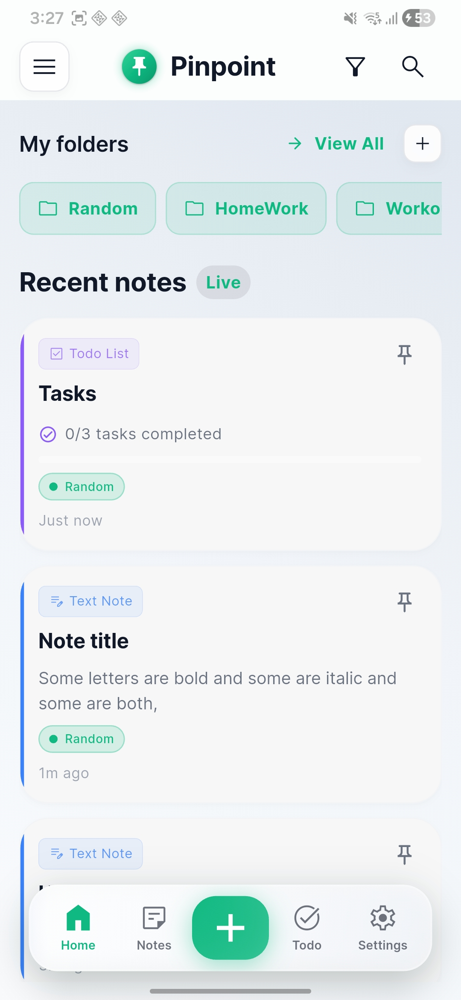
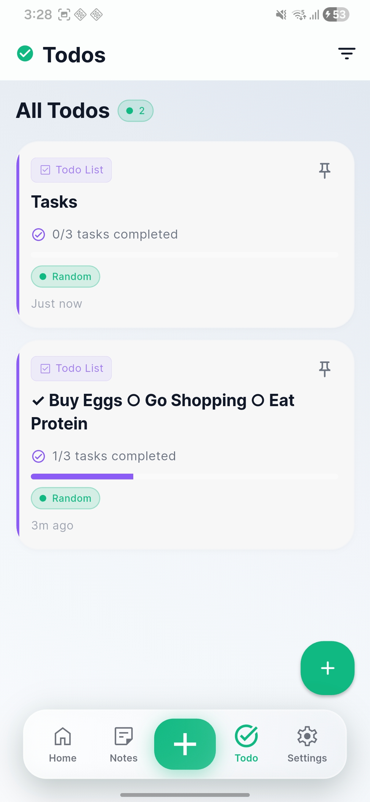
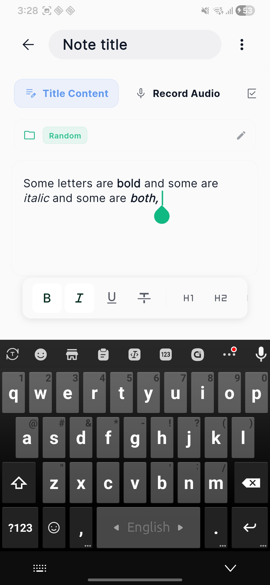
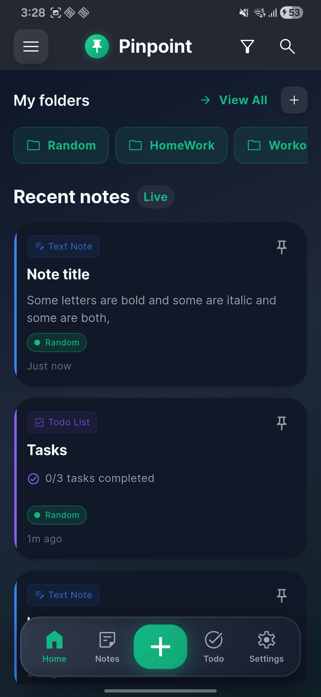
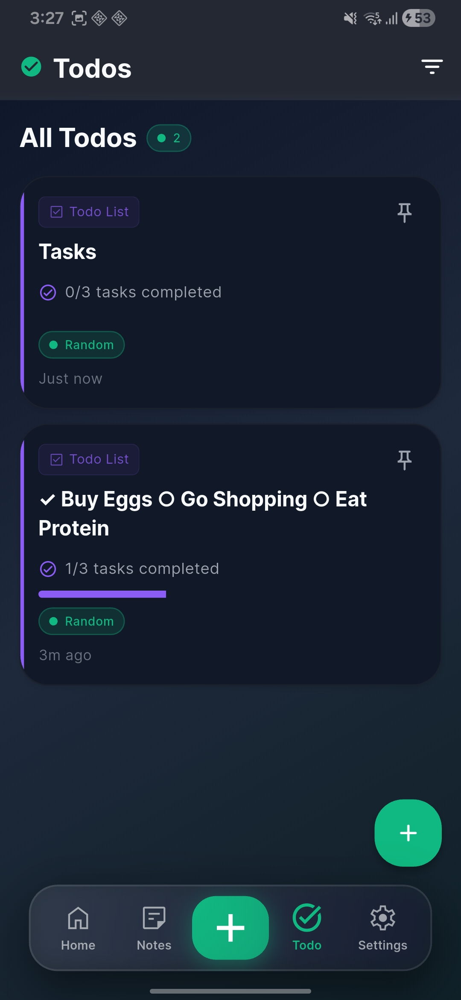
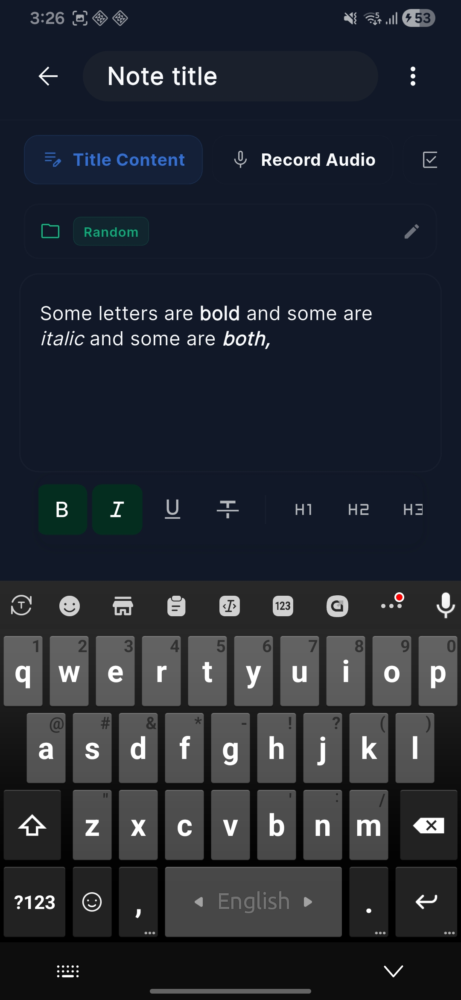

# 📍 Pinpoint

<div align="center">

**A beautiful, privacy-focused note-taking app built with Flutter**

[](https://flutter.dev)
[](https://dart.dev)
[](LICENSE)

[Features](#-features) • [Screenshots](#-screenshots) • [Tech Stack](#-tech-stack) • [Getting Started](#-getting-started) • [Architecture](#-architecture)

</div>

---

## 🎯 Overview

Pinpoint is a feature-rich, privacy-first note-taking application that combines beautiful design with powerful functionality. Built with Flutter and Material Design 3, it offers a seamless experience across all platforms with end-to-end encryption, multiple note types, and advanced organization features.

### Why Pinpoint?

- 🔐 **Privacy First**: End-to-end AES-256 encryption with biometric authentication
- 🎨 **Beautiful Design**: Glassmorphism UI with smooth animations and Material 3
- 📝 **Versatile**: Multiple note types - text, audio, todo lists, and reminders
- 🗂️ **Organized**: Hierarchical folders, tags, pinning, and powerful search
- 🌙 **Dark First**: Gorgeous dark mode with 5 accent color themes
- ⚡ **Fast**: Optimized performance with high refresh rate support
- 🔄 **Cloud Sync**: Real-time sync across devices with backend API
- 💎 **Freemium Model**: Free tier with generous limits, Premium for unlimited

---

## ✨ Features

### 📝 Note Types

- **Title & Content** - Rich text notes with formatting
- **Audio Recording** - Voice notes with playback controls
- **Todo Lists** - Interactive checklists with real-time auto-save
- **Reminders** - Time-based notifications with timezone support

### 🗂️ Organization

- **Folders** - Hierarchical organization with many-to-many relationships
- **Pinning** - Keep important notes at the top
- **Archive** - Store completed or old notes
- **Trash** - Soft delete with restore functionality
- **Search** - Global search across titles and content
- **Sorting** - By date modified, created, or title

### 🔒 Security & Privacy

- **Biometric Lock** - Fingerprint/Face ID authentication
- **End-to-End Encryption** - AES-256 encryption for note content
- **Secure Storage** - Device-specific key management
- **Privacy Focus** - No analytics, no tracking

### 🎨 Design & Customization

- **Glassmorphism** - Beautiful frosted glass effects throughout
- **Material 3** - Modern Material Design language
- **5 Accent Colors** - Mint, Iris, Rose, Amber, Ocean
- **Dark & Light Themes** - Fully themed with high contrast mode
- **High Refresh Rate** - Smooth 120Hz+ support
- **Custom Typography** - 8 Google Fonts to choose from
- **Pill-Shaped Design** - Consistent rounded corners across the app

### 🚀 Advanced Features

- **OCR** - Extract text from images using Google ML Kit
- **Voice Transcription** - Speech-to-text for quick note creation
- **Drawing Canvas** - Sketch and draw within notes
- **Attachments** - Add images and files to notes
- **Export** - Share notes as PDF or Markdown
- **Import/Export** - Backup and restore your notes

### 💎 Premium & Usage Limits

| Feature | Free Tier | Premium |
|---------|-----------|---------|
| Synced Notes | 50 total | Unlimited |
| OCR Scans | 20/month | Unlimited |
| Exports | 10/month | Unlimited |
| Voice Recording | 2 minutes | Unlimited |
| Folders | 5 | Unlimited |
| Theme Colors | 2 | All 5 |
| Attachments/Note | 3 | Unlimited |

### 🔄 Cloud Sync

- **Firebase Authentication** - Google Sign-In with secure token management
- **End-to-End Encryption** - Notes encrypted before leaving device
- **Real-time Sync** - Changes sync instantly across devices
- **Offline Support** - Full functionality without internet
- **Usage Tracking** - Cloud-based limits prevent bypass

---

## 📸 Screenshots

### Light Mode

| Home | Notes | Create Note |
|:----:|:-----:|:-----------:|
|  |  |  |

### Dark Mode

| Home | Notes | Create Note |
|:----:|:-----:|:-----------:|
|  |  |  |

---

## 🛠️ Tech Stack

### Framework & Language
- **Flutter** 3.6.0+ - Cross-platform UI framework
- **Dart** - Modern programming language
- **Material 3** - Latest Material Design

### Database & Storage
- **Drift** 2.24.0 - Type-safe SQLite database with reactive queries
- **Shared Preferences** - Persistent key-value storage
- **Flutter Secure Storage** - Encrypted credential storage
- **Path Provider** - Cross-platform file system paths

### Security & Authentication
- **Local Auth** - Biometric authentication (fingerprint/face)
- **Encrypt** - AES-256 encryption
- **Flutter Secure Storage** - Secure key management

### UI/UX Libraries
- **Google Fonts** - Custom typography
- **Animate Do** + **Flutter Animate** - Smooth animations
- **Staggered Grid View** - Masonry layouts
- **Skeletonizer** - Loading states
- **Toastification** - User feedback

### Media & Input
- **Record** + **Audioplayers** - Audio recording and playback
- **Image Picker** - Image selection from gallery/camera
- **Google ML Kit** - OCR text recognition
- **Speech to Text** - Voice transcription
- **Painter** - Drawing canvas

### Navigation & State
- **Go Router** - Declarative routing
- **Riverpod** 3.0 - Modern reactive state management
- **Get It** - Dependency injection

### Notifications
- **Flutter Local Notifications** - Cross-platform notifications
- **Timezone** - Timezone-aware scheduling

### Export & Sharing
- **Share Plus** - Native share functionality
- **Printing** + **PDF** - PDF generation and export
- **File Picker** - File selection dialogs

### Development Tools
- **Drift Dev** + **Build Runner** - Code generation
- **Logger** - Structured logging
- **Drift DB Viewer** - Database inspection

---

## 🏗️ Architecture

### Clean Architecture with Service Layer

```
lib/
├── screens/              # UI screens
│   ├── home_screen.dart
│   ├── notes_screen.dart
│   ├── todo_screen.dart
│   ├── create_note_screen_v2.dart
│   ├── subscription_screen.dart
│   ├── sync_screen.dart
│   └── ...
├── components/           # Reusable UI components
│   ├── home_screen/
│   ├── create_note_screen/
│   └── shared/
├── services/            # Business logic layer
│   ├── drift_note_service.dart
│   ├── api_service.dart          # Backend API client
│   ├── premium_service.dart      # Usage limits & premium
│   ├── subscription_manager.dart # Google Play billing
│   ├── encryption_service.dart
│   └── ...
├── database/            # Local data persistence
│   └── database.dart
├── entities/            # Drift database tables
│   ├── note.dart
│   ├── note_folder.dart
│   └── ...
├── constants/           # App constants
│   └── premium_limits.dart
├── design_system/       # Complete design system
│   ├── colors.dart
│   ├── typography.dart
│   ├── gradients.dart
│   └── theme.dart
├── navigation/          # Go Router configuration
│   └── app_navigation.dart
├── widgets/             # Shared widgets
│   └── premium_gate_dialog.dart
└── util/               # Utilities and helpers
```

### Key Patterns

- **Service Layer Pattern** - Business logic in static service classes
- **Repository Pattern** - Services abstract database operations
- **Stream-based Reactivity** - Drift watches for real-time updates
- **DTO Pattern** - Separate models for data transfer
- **Dependency Injection** - GetIt service locator
- **Clean Architecture** - Clear separation of concerns

### Database Schema (v4)

```sql
tables:
  - notes (id, title, content, type, encryption, timestamps)
  - note_folders (id, title)
  - note_folder_relations (note_id, folder_id) -- many-to-many
  - note_todo_items (id, note_id, title, is_done)
  - note_attachments (id, note_id, file_path, type)
```

---

## 🚀 Getting Started

### Prerequisites

- Flutter SDK 3.6.0 or higher
- Dart SDK 3.0 or higher
- Android Studio / Xcode (for mobile)
- VS Code or Android Studio (recommended)

### Installation

1. **Clone the repository**
   ```bash
   git clone https://github.com/theprantadutta/pinpoint.git
   cd pinpoint
   ```

2. **Install dependencies**
   ```bash
   flutter pub get
   ```

3. **Configure environment**
   ```bash
   cp .env.example .env
   ```

   Edit `.env` with your configuration:
   ```env
   GEMINI_API_KEY=your_gemini_api_key
   GOOGLE_WEB_CLIENT_ID=your_firebase_web_client_id
   API_BASE_URL_DEV=http://localhost:8645
   API_BASE_URL_PROD=https://your-api-domain.com
   ```

4. **Generate code** (Drift database)
   ```bash
   dart run build_runner build --delete-conflicting-outputs
   ```

5. **Run the app**
   ```bash
   flutter run
   ```

   > **Note**: Debug builds use `API_BASE_URL_DEV`, release builds use `API_BASE_URL_PROD`

### Platform-Specific Setup

#### Android
- Minimum SDK: 24
- Target SDK: 36
- Permissions configured in `AndroidManifest.xml`

#### iOS
- iOS 12.0+
- Permissions configured in `Info.plist`
- Biometric authentication setup required

---

## 🎨 Design System

### Color Themes

Choose from 5 beautiful accent colors:

- **Neon Mint** (default) - `#10B981`
- **Purple Dream** - `#6366F1`
- **Pink Bliss** - `#F43F5E`
- **Orange Sunset** - `#F59E0B`
- **Blue Ocean** - `#0EA5E9`

### Typography

8 Google Fonts available:
- Inter (default)
- Roboto
- Open Sans
- Lato
- Montserrat
- Poppins
- Source Sans Pro
- Noto Sans

### Design Principles

- **Glassmorphism** - Frosted glass effects with backdrop blur
- **Consistent Spacing** - 8px grid system
- **Pill-Shaped** - Rounded corners everywhere (24px for cards, 999px for inputs)
- **Elevation System** - 6 levels (xs, sm, md, lg, xl, xxl)
- **Smooth Animations** - 200-400ms duration with emphasized curves

---

## 📝 Recent Updates

### December 2025 - Cloud Sync & Premium System

#### Cloud Sync Implementation
- 🔄 Full cloud sync with FastAPI backend
- 🔐 Firebase Authentication with Google Sign-In
- 📊 Cloud-based usage tracking (OCR, exports synced to backend)
- 🔁 Auto-reconciliation of synced notes count
- 📱 Offline-first with background sync

#### Premium & Subscription
- 💎 Google Play Billing integration
- 📈 Usage limits enforced locally and on backend
- 🎁 Grace period support for expired subscriptions
- 🔔 Premium gate dialogs with upgrade prompts
- 📊 Usage indicators in menus (e.g., "Export PDF (5/10)")

#### Environment Configuration
- 🔧 Separate dev/prod API URLs
- 🚀 Auto-switches based on build mode (debug vs release)
- 📝 Added `.env.example` for easy setup

### January 2025 - Major Design & UX Overhaul

#### Design System Enhancements
- ✨ Implemented comprehensive glassmorphism across all screens
- 🎨 Added gradient backgrounds to headers and UI elements
- 🔄 Unified design language with consistent pill-shaped components
- 🌈 Enhanced light mode with optimized shadow intensities

#### Note Creation System
- ⚡ Implemented real-time auto-save for all note types
- 🔢 Added temporary ID system for unsaved todo items
- ✅ Improved validation and error handling

#### Theme Customization
- 🌓 Added light/dark theme toggle in settings
- 💾 Persistent theme preference using SharedPreferences
- 🎨 5 accent color themes with proper theming

---

## 🗺️ Roadmap

### Completed
- [x] **Cloud Sync** - Custom backend with FastAPI
- [x] **Premium System** - Google Play Billing integration
- [x] **Firebase Auth** - Google Sign-In authentication
- [x] **Usage Tracking** - Cloud-based limits

### Upcoming Features
- [ ] **Collaboration** - Share and collaborate on notes
- [ ] **Tags System** - Multi-tag support for notes
- [ ] **Templates** - Pre-built note templates
- [ ] **Web Clipper** - Save web content directly
- [ ] **Markdown Editor** - Full markdown editing support
- [ ] **Calendar View** - Timeline and calendar integration
- [ ] **Widgets** - Home screen widgets
- [ ] **iOS Release** - App Store deployment

### Testing & Quality
- [ ] Unit tests for services
- [ ] Widget tests for UI components
- [ ] Integration tests for user flows
- [ ] CI/CD pipeline setup

---

## 🤝 Contributing

Contributions are welcome! Please feel free to submit a Pull Request.

1. Fork the project
2. Create your feature branch (`git checkout -b feature/AmazingFeature`)
3. Commit your changes (`git commit -m 'Add some AmazingFeature'`)
4. Push to the branch (`git push origin feature/AmazingFeature`)
5. Open a Pull Request

---

## 📄 License

This project is licensed under the MIT License - see the [LICENSE](LICENSE) file for details.

---

## 🙏 Acknowledgments

- Flutter team for the amazing framework
- Material Design team for the design guidelines
- All open-source package contributors
- The Flutter community

---

## 📧 Contact

**Project Link:** [https://github.com/theprantadutta/pinpoint](https://github.com/theprantadutta/pinpoint)

---

<div align="center">

Made with ❤️ using Flutter

**⭐ Star this repo if you find it useful!**

</div>
