# Sketchbook redesign — notes

Branch: `redesign/sketchbook` (not merged to `master`). Backend: `feature/sketchbook-support`
in `pinpoint-backend` (not merged). Neither is pushed.

The handoff (tokens, specs, mocks) was implemented as a re-skin plus UX polish: every feature,
data flow, analytics event, premium gate, encryption path and localization still works. Device
QA was done on a Galaxy A24 (phone, 1080×2340) and a Galaxy Tab (600dp portrait / 1006dp
landscape), in light, dark and Arabic (RTL). `flutter analyze` is clean and `flutter test`
passes (291 tests; was 192).

## Screenshots (real devices, seeded demo data, Pro accounts)

| | Light | Dark |
|---|---|---|
| Home | 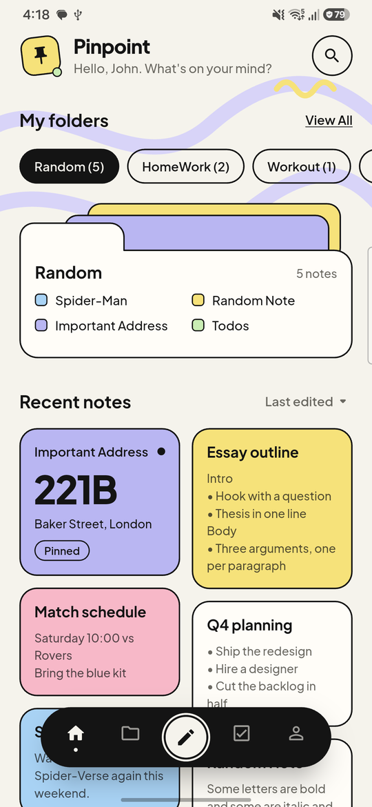 | 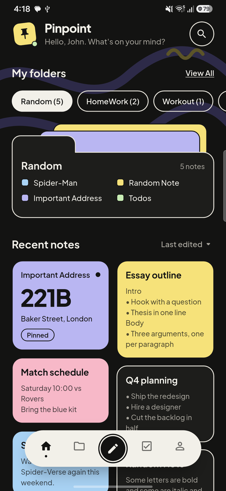 |
| Drawer | 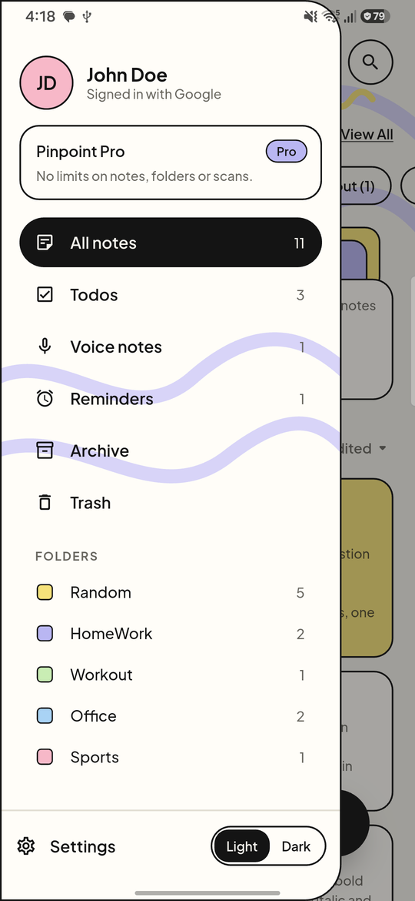 | 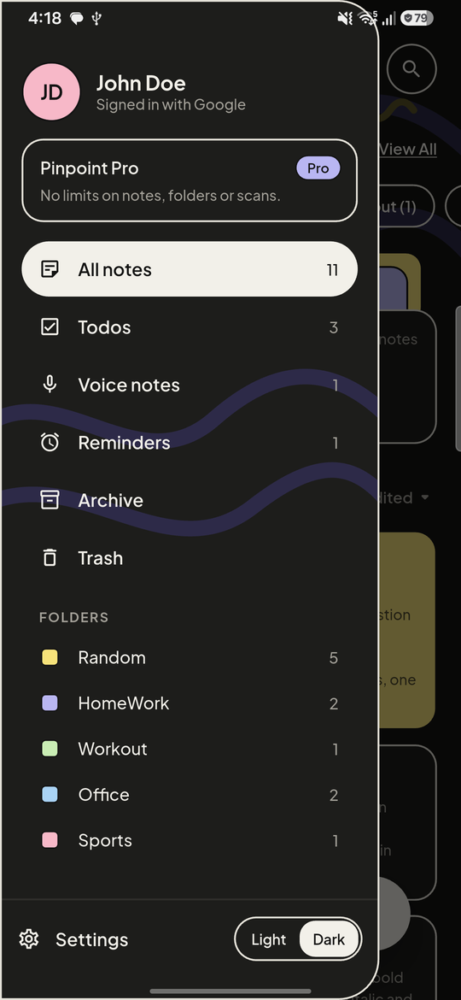 |
| My folders | 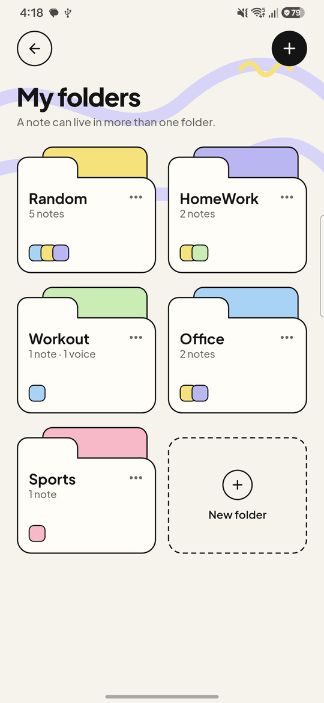 | 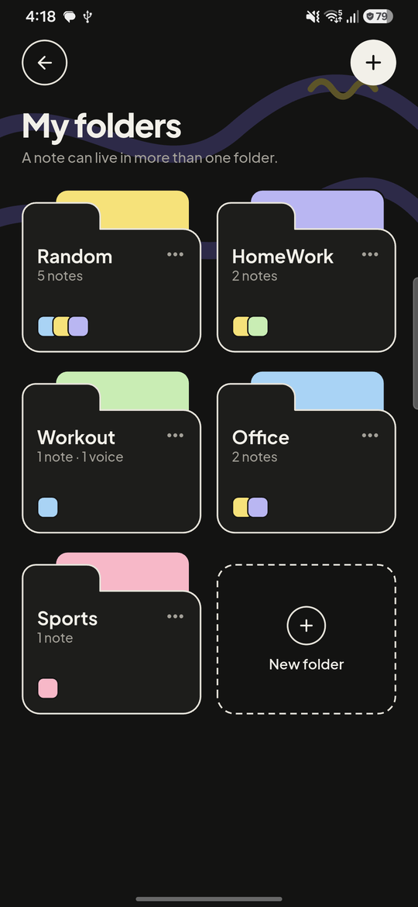 |
| Note editor | 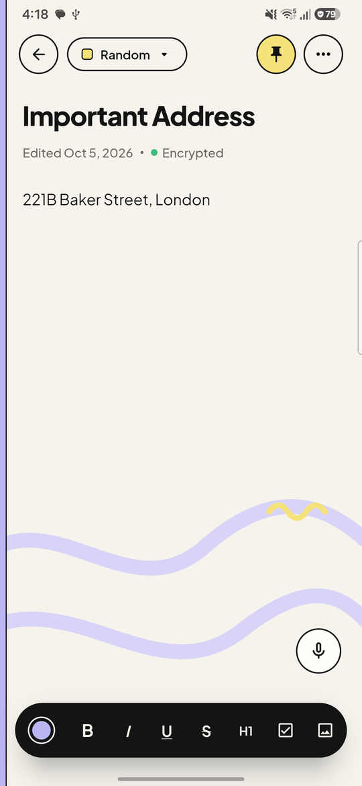 | 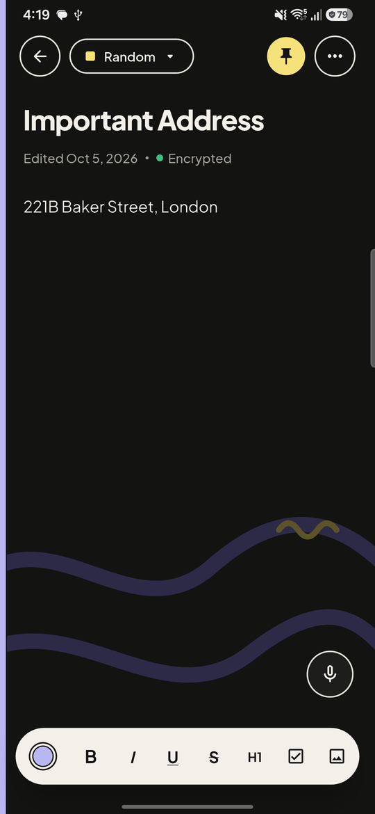 |
| Todos | 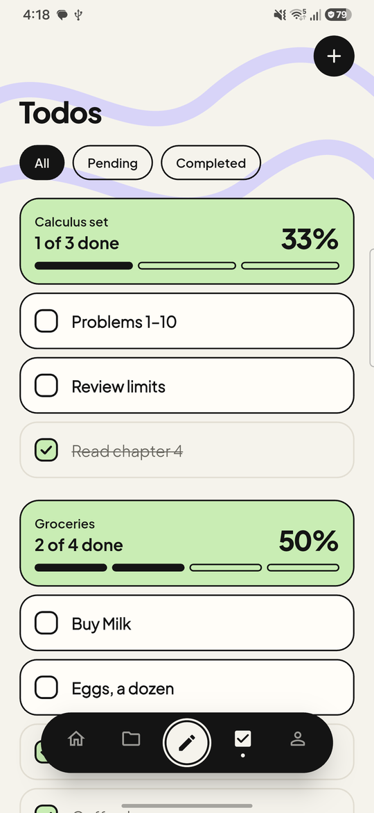 | 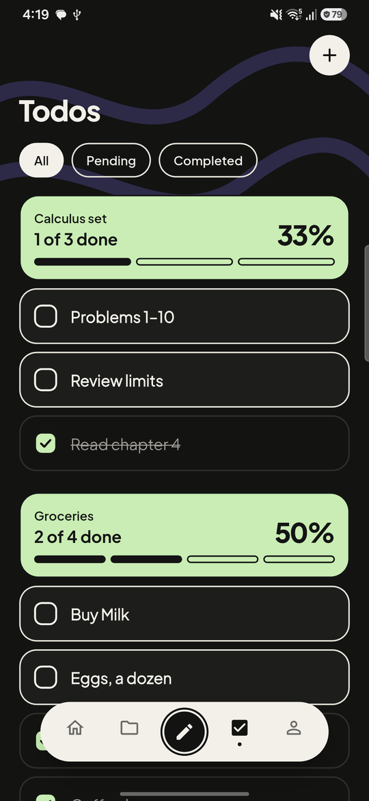 |
| Checklist note | 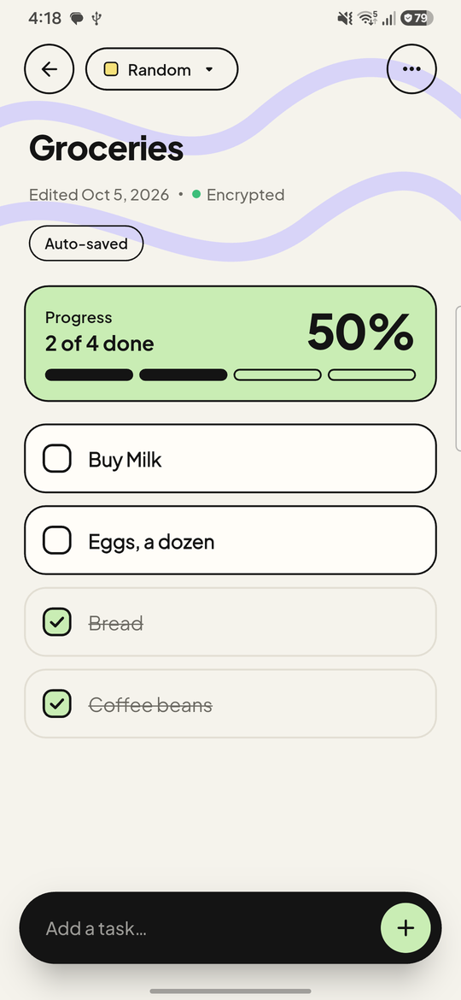 | 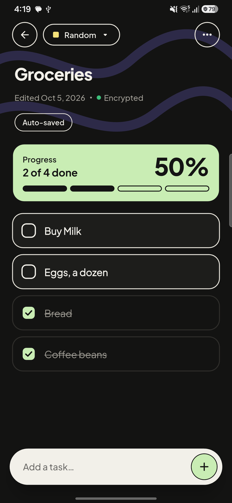 |
| Filters | 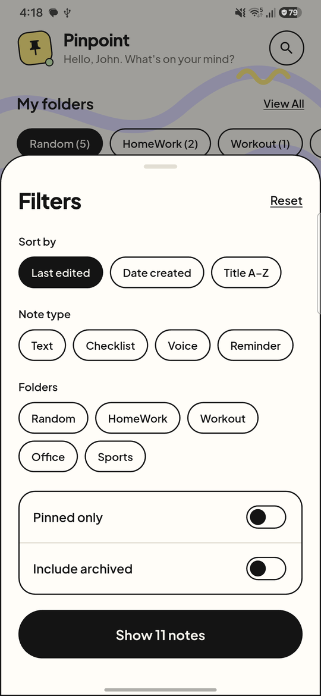 | 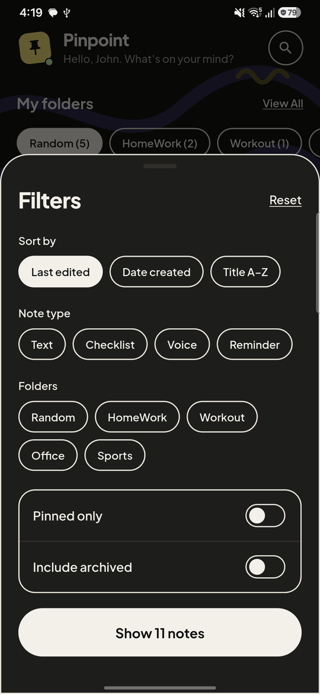 |
| Settings | 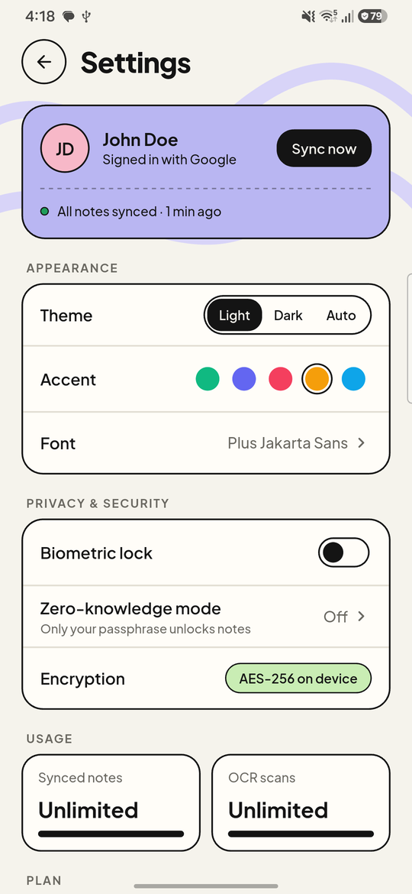 | 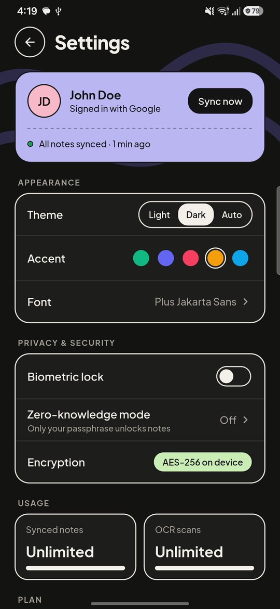 |
| Paywall (free account) | 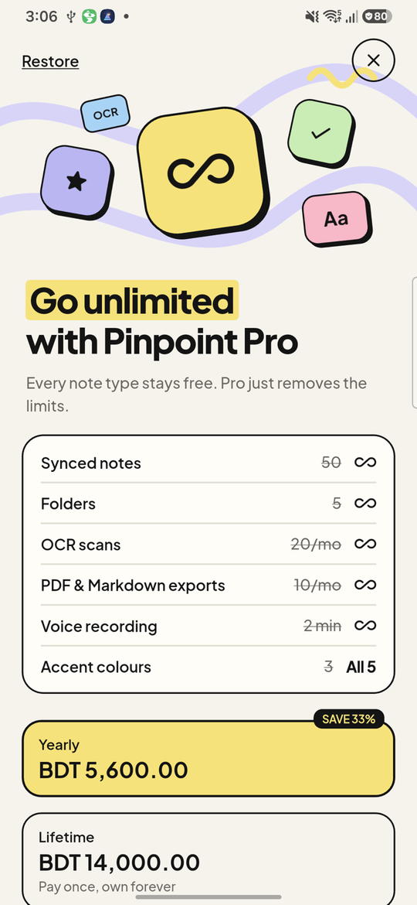 | |

Tablet: 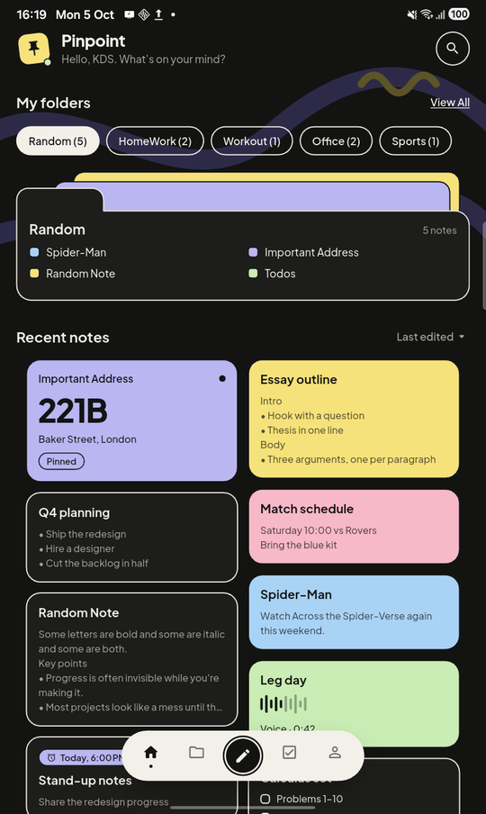
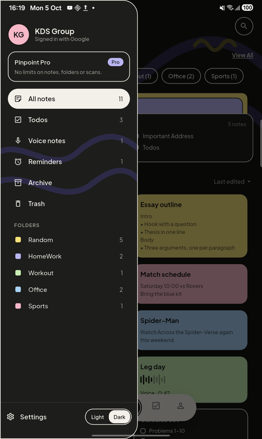
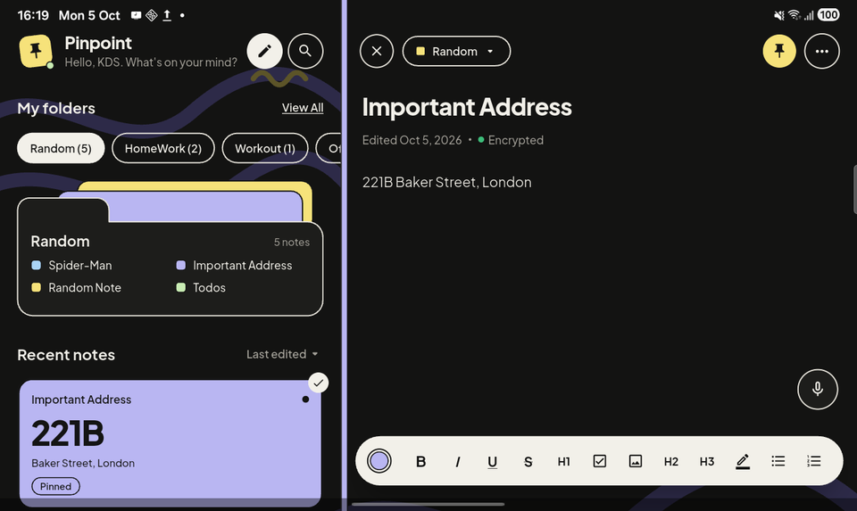

## What changed

**Foundation**
- Tokens as theme extensions: `SketchColors` (`context.sketch`), `SketchText` (`context.type`),
  `SketchPastels`, `SketchAccent`, `SketchSpace` / `SketchRadius` / `SketchStroke`,
  `SketchShadows`, `SketchMotion`. One builder makes both ThemeData, so light and dark cannot drift.
- Fonts: Plus Jakarta Sans (200–800 + italics) and Caveat 600, bundled as Latin subsets. Plus
  Jakarta Sans is the default and is in the font picker. Thai/Bengali/Arabic fallbacks unchanged.
- Component library in `lib/design_system/components/sketch/`: card (outlined, pastel, dashed),
  chip, tag, pill button, circle icon button, dock, folder tile and preview, checklist row,
  checkbox, progress card, toggle, segmented control, sheet, sticker, brand sticker, avatar,
  marker highlight, doodle background, scaffold and settings rows, text field. Goldens in light
  and dark under `test/goldens/`.
- Removed: glassmorphism, gradients, blur, the Brutalist components and seven packages that
  nothing used any more.

**Screens** — every screen, including the ones not mocked: splash, onboarding (+ a one-time
What's new for upgraders, via `onboardingVersion`), terms, auth, account linking, unlock, home,
drawer, dock shell, notes, todos, folder, My folders, archive, trash, editor (text, checklist,
voice, reminder), filters, settings and every sub-screen, paywall, premium gate, usage sheets,
toasts, confirm sheets, popup menus, the forced-update screen, debug tools (tokens only).

**Navigation** — the dock (Home · Notes · Create · Todos · Settings) now really switches the
shell's branches. Create opens a text note; long-press picks Checklist, Voice or Reminder.
Under 840dp: dock + modal drawer. From 840dp: list | editor split, with a New note button in the
header. From 1200dp the drawer is pinned as a sidebar.

**Icons & splash** — launcher icons for every platform regenerated from the recoloured pin
(`branding/`, `flutter_launcher_icons.yaml`), native splash light/dark incl. Android 12
(`flutter_native_splash.yaml`), and a proper white status-bar notification icon.
`branding/build_icons.py` draws what the icon tool cannot: the brand sticker for macOS and
Android 7 (neither masks icons), the round and status-bar icons, a multi-size Windows `.ico`, a
32px favicon, and the backend pages' icons. Run it after `dart run flutter_launcher_icons`.
The Play listing icon is `store/play-icon-512.png`.

**Data & sync**
- Folders get a colour and manual order (Drift schema v12, idempotent migration + test).
  Folders without a stored colour resolve round-robin in creation order, the same on every device.
- Appearance preferences sync across devices (`/users/me/preferences`), offline-first,
  last-write-wins.
- Note colours: 11 Keep swatches → the design's 5 pastels; old names map to the nearest pastel
  at display time, nothing is rewritten.

## Bugs found and fixed along the way
- The V2 note-list streams polled the database every 100ms and rebuilt the grid ten times a
  second. They now recompute only on writes.
- Filters never applied to any list, and the provider held an uninitialised `FilterService`.
- Back at the shell exited the app (predictive back + `BackButtonListener`); back with the drawer
  open did nothing.
- Reminder sync parsed the server's zone-less UTC times as local: reminders moved by the UTC
  offset (an 18:00 reminder in Dhaka showed 12:00). Folder sync had the same issue.
- Folder renames never synced (`updatedAt` was not bumped).
- An expired monthly subscriber could never buy monthly again (paywall hid the "current" plan).
- **Entitlement** — the subscription "device id" on Android was `Build.ID`, the firmware build
  number shared by every phone on that firmware; and Pro never followed the account to a second
  device. Signed-in devices now also honour account-level premium (never downgrading, fully
  offline-safe), and new installs use a random per-install id. **Existing installs keep their
  old id**, so device rows keyed on build numbers still exist in production — see open items.
- Plus: a stored "Source Sans Pro" font crashed theme building; sign-out toast never showed;
  card previews lost list bullets; note text now follows its own direction in RTL.

## Deviations from the handoff, and why
- **Default accent Amber is free.** The spec keeps the free/premium split *and* makes Amber the
  default, but Amber was premium. A free user could leave the default and never return, so Amber
  joined the free set (free accents: Amber, Mint, Ocean — the paywall reads "3 → All 5").
- **Brand sticker opens the drawer on tap** as well as long-press, for discoverability.
- **No dock on wide screens** (≥840dp): it would float over the split view's editor toolbar.
- **Folder WP05 schema moved earlier** (into the home work) because home and drawer need colours.
- **Note colour in the editor:** a 6px leading edge (the spec offered edge or top tint).
- **Uncoloured notes' bullets** in folder previews use their *type* pastel (Text yellow,
  Checklist mint, Voice sky, Reminder lavender), matching the Filters sheet.
- **No card → editor container transform**: the editor is a go_router page; the default page
  transition is used.
- **"Export all" not built** (no such feature); **no biometric shortcut on Unlock** (no
  `local_auth` path for the ZK key); **"Use without account"** does not exist, so not shown.
- **Trash banner** says notes stay until emptied: there is no retention job anywhere.
- **Glyphs** ✓ ★ ∞ are icons, not text: the UI fonts have none of them.
- **Google Play's in-app review sheet** is system UI and cannot be restyled.

## Backend (`feature/sketchbook-support`)
- Folder `color` / `sort_order` (migration `AddFolderColorAndSortOrder`), last-write-wins on the
  client's `updated_at` (stale uploads no longer revert renames).
- `GET/PUT /api/v1/users/me/preferences` (migration `AddUserPreferences`).
- `folders` added to `GET /api/v1/usage/stats`.
- `grant-premium` tool: temporary account-level premium by email, auto-expiring
  (`dotnet run --project src/Pinpoint.Api -- grant-premium --email x --days 30`).
- New test project (59 tests). README documents all of it.

## Open items for you
1. **Shared device ids in production.** Existing Android installs still send the firmware build
   number. Device rows keyed on it (e.g. `BP4A.251205.006`, owned by `kdsgmt.it@gmail.com`) can
   collide across users. Options: have the client migrate to a per-install id after a successful
   purchase restore, and/or have the device-status endpoint require the owning account.
2. Both test accounts (`realjohndoe276@gmail.com`, `kdstabsystem@gmail.com`) have premium until
   2026-11-04 via `grant-premium`; revoke with `--revoke` when done.
3. The demo seeder (`lib/dev/demo_seed.dart`) only runs in debug builds with
   `--dart-define=PINPOINT_SEED_DEMO=true`.
4. The Drawing entry remains unreachable (pre-existing product decision).
